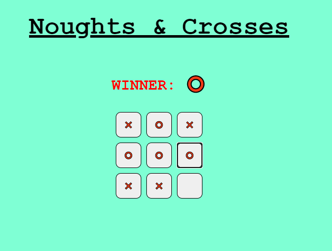

# Noughts & Crosses

#### School of Code Bootcamp - Hackathon Week 6

_Our Week 6 Hackathon challenge was to make a Noughts & Crosses game! This was the first React hackathon we'd done and it was really interesting as we were following a tutorial that that made Noughts & Crosses with the old style of React - using Class components. Our job was to translate that into new React - Functional Components and hooks!_

### Main Learning Points:

- Extracting relevant information from resources that are solving the same problem but in a different way
- To have stateful components in react before hooks were invented you had to write a class component
- React components automatically re-render whenever there is a change in state or props.
- Dumb components (functional components without hooks) can also be called presentational components
- If you're trying to create a new array from `setState()` don't forget to use the square brackets inside the parenthesis!! (held us up for ages)
- `console.log` everything! At one point I had handed in an argument to a function as a number but it was expecting an object as I'd put curly braces around it in the params. Again this held us up for a while but was easily caught once we had console logged
- you can have more than one `useState()` in a component
- `useState()` is asynchronous which can sometimes cause problems!
- even if you're following a tutorial it's still important to make a plan
